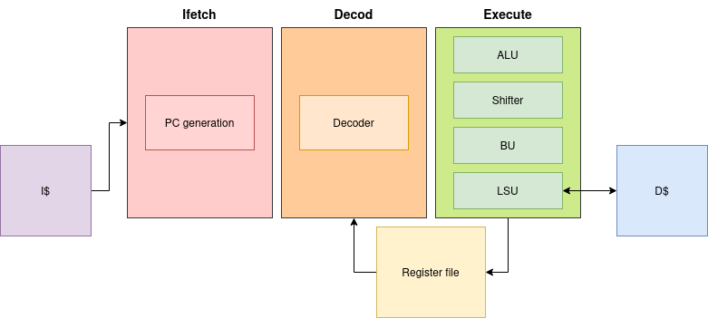
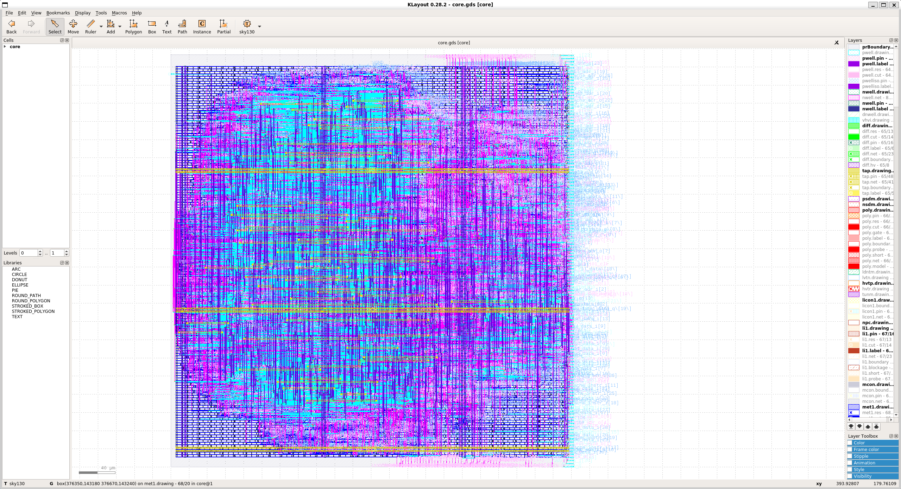

# What holds this git

The purpose of this git is to allow you to use an open source and well documented RISCV core.
The core is a RV32I and has been designed using system verilog. For the verification we used the [riscof framework](https://github.com/riscv-software-src/riscof).\
You can run any rv32i bare-metal programm written in assembly of C on the core.

# Setup

To setup all the dependencies you will need a couple of bash script. And of course you will need a linux distribution. The code have been runned under the following distribution :
* Ubuntu 22.04
* WSL2 (Windows Subsytem for Linux)

It should work on other Unix distributions but some modification may be needed on the scripts.\
To setup your environment please run :
```bash
source setup.sh
./setup-riscof.sh
```

After that you're suppose to be good to go. If not please raise an issue.

# How to launch the simulation
## Makefile commands
A makefile is used to build and run the simulation, here's a quick explanation of the commands you can run
```make
make run # run a default test
make run TEST=path/test_name # run the custom test given in argument
make core_tb      # compile the design
make riscof_build # build riscof framework and needed tests
make riscof_run   # run riscof framework
make impl         # Open a docker that allow to run the implementation
```
## Single test
If you want to run the test bench by hand here are the needed steps :
```make
make core_tb # this will build the obj_dir/ directory
obj_dir/Vcore path/test_name
```

Running the above command will run the simulation and generate a wave file ``logs/vlt_dump.vcd`` that can be visualise using gtkwave

## Multi tests using Riscof

[Riscof](https://github.com/riscv-software-src/riscof) is an open source framework that allow to test your design. It is splitted in one test per instruction that allow to detect most type of error.\
Our design has a ``100% pass`` rate on the **RV32I** tests.\
In the past we encountered error while running C programms even with a 100% pass rate on riscof so the framework is not perfect.\
This is why we also run some custom C programm that allow us to test more deeply the design.\
If you encounter any issue while executing a programm and that you triple check your programm should work properly please reach out.\
If you want to manually run a riscof test file you can run the following command :
```make
make core_tb
obj_dir/Vcore riscof/riscof_work/rv32i/I/src/test_name/dut/my.elf --riscof signature.txt
```
This will run the riscof elf file and generate a signature file name ``signature.txt``.\
 To verify the test ran successfully, riscof compared the generated file ``signature.txt`` with the one in ``riscof/riscof_work/rv32i/I/src/test_name/ref/Reference-spike.signature ``

# Design
This core is a scalar in order pipeline containing 3 stages which are :

- **Ifetch** : Receive the PC from exe and fetch the associated instruction from the memory
- **Decode** : Decodes the instruction, collect the source registers values (from register file or from forwards) and generate the control signals for the execute stage.
- **Execute** : Contains multiple units to execute instructions and write if needed the destination register.
    * ALU : Arithmetic and logic computation (ADD, AND, OR, XOR, SLT).
    * Shifter : Logics and arihmetic shifts (Sll, Slr, sra)
    * BU : Branch Unit, which computes the branches and jumps instructions.
    * LSU : Load Store Unit, which handles all memory accesses



# Verification

## Custom programms

Our test-bench is abled to run any type of **RV32I** assembly, c or elf files. But you need to ensure some things to be sure the programm with run successfully.\
Any files must start with the following lines of code :
```s
.section .text
.global _start

_start :
you code here
```
And and the end of the program you need to jump to ``_good`` if the programm ran successfully or jump to ``_bad`` if it didn't. Here's a quick example :
```s
.section .text
.global _start

_start :
       li x17, 1383
       li x1, 966
       add x29, x17, x1
       li x23, 2349
       bne x29, x23, _bad
       j _good
```
The previus program is performing an addition and if the result is correct it jumps to _good otherwise to _bad.
For C files it is quite the same things, you need to call the __asm__ macro :
```c
extern void _bad();
extern void _good();

__asm__(".section .text") ;
__asm__(".global _start") ;

__asm__("_start:");
__asm__("addi x1,x1, 4");
__asm__("sub x2, x2,x1 "); // Initialise the stack
__asm__("jal x5, main");
int main() {
    // Your code here
    (success) ? good() : bad(); //jump either to good or bad depending on the success
}
```
You may not call the ``_good`` or ``_bad`` label, but if you do not when you program will arrive to the end it will juste execute nothing and after a maximum numbers of cycle the program will be terminated by the test-bench.

# Implementation
## Setup
To perform the implementation we're using [OpenLane](https://github.com/The-OpenROAD-Project/OpenLane).
1st you will need to install docker, it will reboot your computer :
```sh
sudo apt-get update
sudo apt-get upgrade
sudo apt install -y build-essential python3 python3-venv python3-pip make git
# Remove old installations
sudo apt-get remove docker docker-engine docker.io containerd runc
# Installation of requirements
sudo apt-get update
sudo apt-get install \
   ca-certificates \
   curl \
   gnupg \
   lsb-release
# Add the keyrings of docker
sudo mkdir -p /etc/apt/keyrings
curl -fsSL https://download.docker.com/linux/ubuntu/gpg | sudo gpg --dearmor -o /etc/apt/keyrings/docker.gpg
# Add the package repository
echo \
   "deb [arch=$(dpkg --print-architecture) signed-by=/etc/apt/keyrings/docker.gpg] https://download.docker.com/linux/ubuntu \
   $(lsb_release -cs) stable" | sudo tee /etc/apt/sources.list.d/docker.list > /dev/null
# Update the package repository
sudo apt-get update
# Install Docker
sudo apt-get install docker-ce docker-ce-cli containerd.io docker-compose-plugin
sudo groupadd docker
sudo usermod -aG docker $USER
sudo reboot # REBOOT!
```
Then you will need to run the following script to setup the install :
```sh
./setup-implem.sh
```
## Running the flow
Once the flow is setup you will be able to generate the GDSII of the design using :
```sh
make impl #will go to implementation/OpenLane and run make mount
# The below command should be run in the docker env launched by the previus command
./flow.tcl -design core -tag run_10ns -config_file designs/core/config.json
klayout -e -nn $PDK_ROOT/sky130A/libs.tech/klayout/tech/sky130A.lyt \
   -l $PDK_ROOT/sky130A/libs.tech/klayout/tech/sky130A.lyp \
   designs/core/runs/run_10ns/results/final/gds/core.gds
```
GDSII with skywater 130nm process

