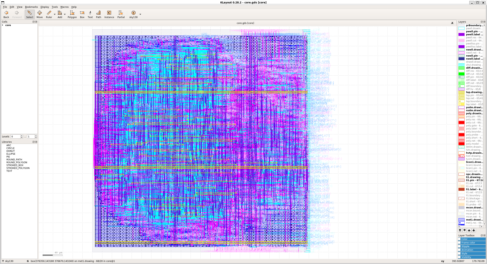

# Implementation
## Setup
To perform the implementation we're using [OpenLane](https://github.com/The-OpenROAD-Project/OpenLane).
1st you will need to install docker, it will reboot your computer :
```sh
sudo apt-get update
sudo apt-get upgrade
sudo apt install -y build-essential python3 python3-venv python3-pip make git
# Remove old installations
sudo apt-get remove docker docker-engine docker.io containerd runc
# Installation of requirements
sudo apt-get update
sudo apt-get install \
   ca-certificates \
   curl \
   gnupg \
   lsb-release
# Add the keyrings of docker
sudo mkdir -p /etc/apt/keyrings
curl -fsSL https://download.docker.com/linux/ubuntu/gpg | sudo gpg --dearmor -o /etc/apt/keyrings/docker.gpg
# Add the package repository
echo \
   "deb [arch=$(dpkg --print-architecture) signed-by=/etc/apt/keyrings/docker.gpg] https://download.docker.com/linux/ubuntu \
   $(lsb_release -cs) stable" | sudo tee /etc/apt/sources.list.d/docker.list > /dev/null
# Update the package repository
sudo apt-get update
# Install Docker
sudo apt-get install docker-ce docker-ce-cli containerd.io docker-compose-plugin
sudo groupadd docker
sudo usermod -aG docker $USER
sudo reboot # REBOOT!
```
Then you will need to run the following script to setup the install :
```sh
./setup.sh -i 5
```
## Running the flow
Once the flow is setup you will be able to generate the GDSII of the design using :
```sh
make impl #will go to implementation/OpenLane and run make mount
# The below command should be run in the docker env launched by the previus command
./flow.tcl -design core -tag run_10ns -config_file designs/core/config.json
klayout -e -nn $PDK_ROOT/sky130A/libs.tech/klayout/tech/sky130A.lyt \
   -l $PDK_ROOT/sky130A/libs.tech/klayout/tech/sky130A.lyp \
   designs/core/runs/run_10ns/results/final/gds/core.gds
```
GDSII with skywater 130nm process

