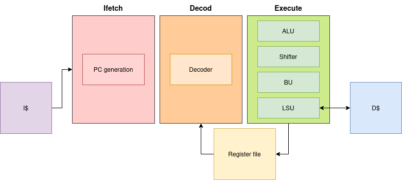

Micro Architecture
==================

| This section describes the micro architecture of the core and gives some explanation about the design choices.
| The core is a 4 stages pipeline in order micro architecture. It is designed using system verilog and it composed of the following stages :

- **IFetch**
- **Decod**
- **Exe**
- **Write back**

.. toctree::
   :glob:

   ifetch.rst
   dec.rst
   exe.rst
   rf.rst