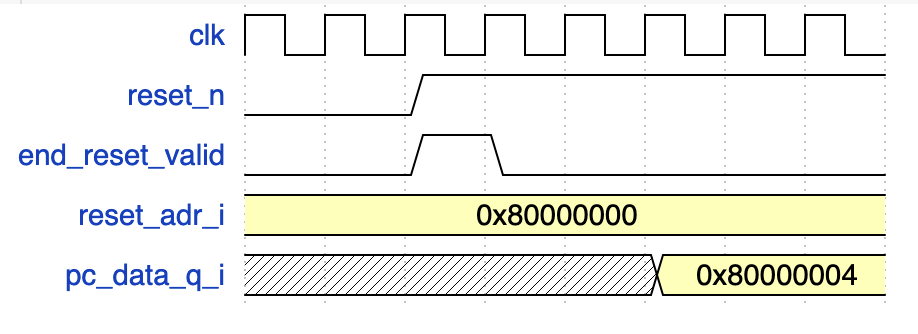

Micro Architecture
==================

| This section describes the micro architecture of the core and gives some explanation about the design choices.
| The core is a 4 stages pipeline in order micro architecture. It is designed using system verilog and it composed of the following stages :

- **IFetch**
- **Decod**
- **Exe**
- **Write back**

IFetch
------

This stage is responsible of the fetch of the instruction and the fetch of the 1st instruction after the reset.

Reset
^^^^^

| The reset we are using is a negative reset, it means it is active on low value. One of the role of Ifetch is to fetch the first instruction after the reset.
| Thus Ifetch has to detect the end of the reset and when it is valid it must fetch the first instruction.  
| The boot address is written in the signal `reset_adr_i`, which is an interface of the core.
| The stage contains an adder to calculate the next PC. We have to do this because since the PC is calculated in EXE, during the first 3 cycles EXE will not send the new PC to fetch.
| The below timing diagram illustrate this behavior

On this diagramm we have :

- ``clk``              : the clock
- ``reset_n``          : the reset signal
- ``end_reset_signal`` : a valid bit that indicate the end of the reset
- ``reset_adr_i``      : contains the reset address to fetch
- ``pc_data_i``        : the pc sent by exe

During the first two cycles the reset is active and thus nothing should happen.
Then on the **3d** cycle the reset end and thus the first instruction is fetched
using the address sent by ``reset_adr_i``. So it's only during **5th** cycle that
``EXE`` receive the first instruction, thus the next PC will be calculated only during the 5th cycle.
But since the output of ``EXE`` are flopped the information of the next PC will only arrive in Ifetch during the
6th cycle.
| This is to avoid this waiste of time that we are using an adder in Ifetch to calculate the next PC.

Next instruction
^^^^^^^^^^^^^^^^

| In a normal situation, i.e. when reset is done, Ifetch receives the programm counter (PC) from EXE and fetch the next instruction. 
| If a branch occur ``flush_v_q_i`` is set to 1 and Ifetch will not take the sequential PC it has estimated but instead it will takes the PC calculated by EXE. 

Interface with the memory
^^^^^^^^^^^^^^^^^^^^^^^^^

| The core is not using any cache for now, so is it directly connected to the memory which is emulated thanks to a map in the core_tb plateform.
| In the future we may add a latency to access the memory and add cache to compare the gain of performance.

Decod
-----

The decod stage is responsible of the instruction's decoding. It has infteraces with the following modules :

- Ifetch
- Exe
- Register file (rf)

`instr_q_i` represents the instruction sent by Ifetch and received by Decod that must be decoded.
It is first sent to the decoder module which is responsible of detecting which instruction is currently decoded.

Decoder
^^^^^^^

The decoder detect the instruction currently decoded and generate the following signals :

- ``rd_v_o`` : indicates that the destination register is valid, i.e. the instruction produce a value that has to be written in the register file
- ``rd_o`` : address of the destination register
- ``rs1_v_o`` : indicates that the register rs1 of the instruction is valid, i.e. the port 1 of the register file will be used to read data
- ``rs1_adr_o`` : address of the source register 1
- ``rs2_v_o`` : indicates that the register rs2 of the instruction is valid, i.e. the port 2 of the register file will be used to read data
- ``rs2_adr_o`` : address of the source register 2
- ``auipc_o`` : indicates that the decoded instruction is auipc
- ``rs2_is_immediat_o`` : indicates that the second operand of the instruction is an immediate
- ``immediat_o`` : immediat data 
- ``access_size_o`` : indicate the type of memory access (word, half-word, byte)
- ``unsign_extension_o`` : indicate that an unsigned extension of the source data should be performed
- ``unit_o`` : indicate the unit to be used (alu, lsu, bu...etc)
- ``operation_o`` : indicate the operation to perform (or, xor, add, sub...etc)
- ``rs2_ca2_v_o`` : indicate a two's complement should be performed on the second operand
  
| Both ``unit`` and ``operation`` are encoded using one-hot encoding. To avoid using too much bit we tried to group the instruction by operation.
| For example an ``add`` and the ``sub`` share the same encoding but ``rs2_ca2_v_o`` should be set to 1.
| The operation to perform and the unit to use can be visualised as a single bit vector where the **msb** designed the unit and the **lsb** designed the operation to perform.
| The unit is encoded as follow :

- 00001 xxx : alu
- 00010 xxx : shifter
- 00100 xxx : branch
- 01000 xxx : lsu
  
The operation is encoded as follow :

- **alu** :

  - 00001 000001 : add, sub
  - 00001 000010 : and
  - 00001 000100 : or
  - 00001 001000 : xor
  - 00001 010000 : slt

- **shifter** :

  - 00010 000001 : sll
  - 00010 000010 : srl
  - 00010 000100 : sra

- **branch unit (bu)** :

  - 00100 000001 : beq
  - 00100 000010 : bne
  - 00100 000100 : blt
  - 00100 001000 : bge
  - 00100 010000 : jal
  - 00100 100000 : jalr

- **lsu (load store unit)**

  - 01000 000001 : store
  - 01000 000010 : load

Data formatting
^^^^^^^^^^^^^^^

| Once the data is sent to EXE it must have collected the correct value for both source operands.
| The data of the source operands can be collected from many differents places :

- Register files (rf) : when the instruction is using the r-format both operands comes from the rf
- immediat : if the instruction is using an immediat then the source data comes directly from the instruction itself
- pc : ``auipc`` use the pc as a source operand, this is why we are using a special encoding the detect the auipc instruction
- forwards : when we have data dependencies we may use forwards to collect the data from the output of EXE (before or after the final exe flops)

Once the correct data is collected we need to format is i.e. perform the two complement if needed, extend the data (signed or unsigned extension)

Interface with EXE
^^^^^^^^^^^^^^^^^^

| Decod send and receive informations from EXE. 
| When the decoding and the data processing is finished, all the informations are flopped and send to EXE.
| But Decod also need to collect data from EXE, this is what we call the fast forwards (ff).

Exe
---

Description of Exe...

Write Back
----------

Description of Write Back...
